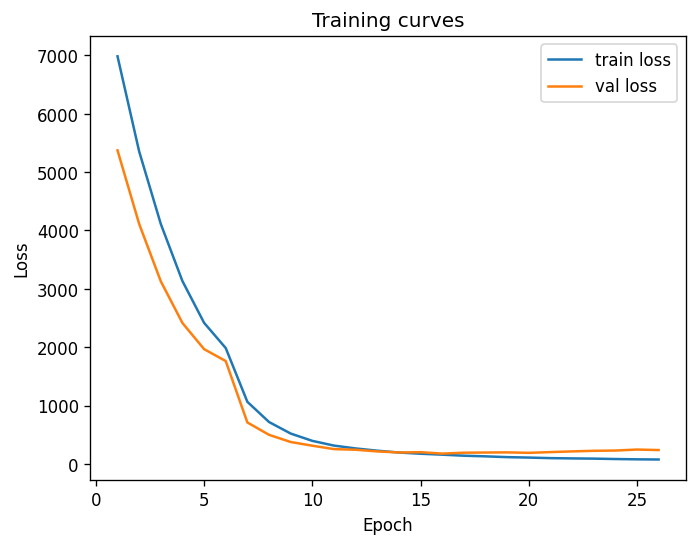
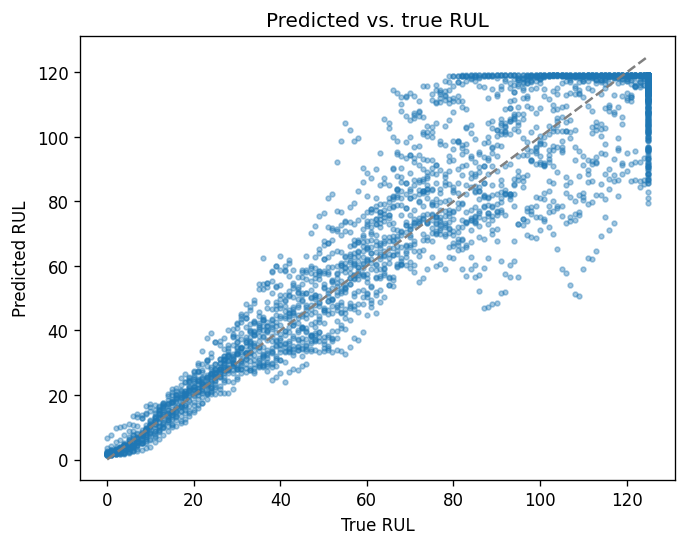
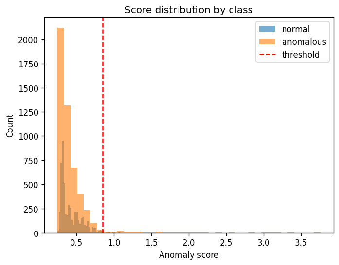
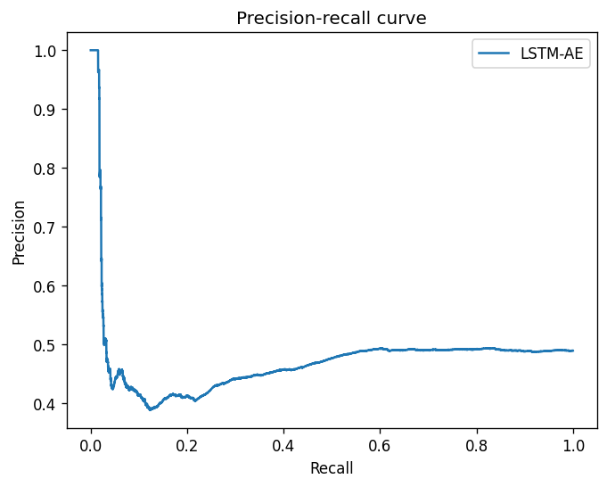
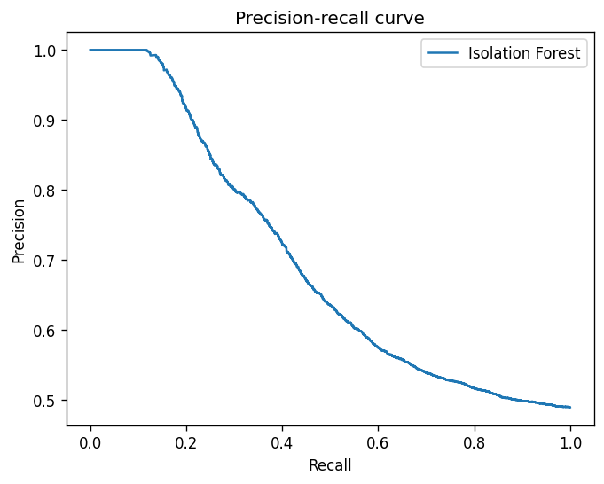
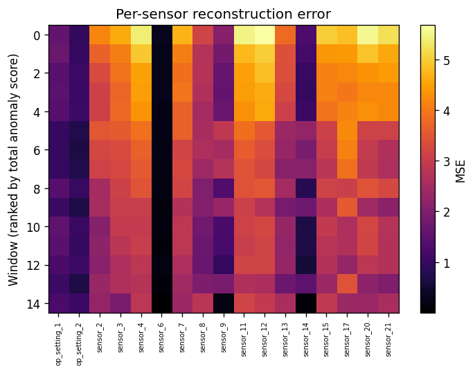
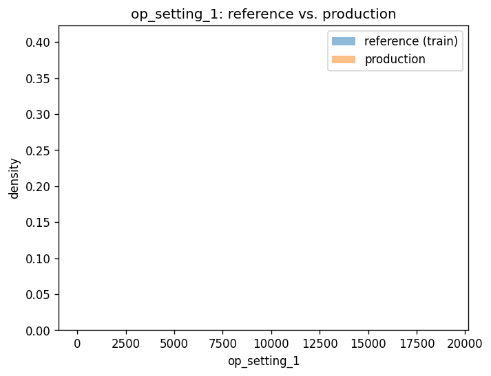

# Case study: PdM-Sentinel

This page is the narrative walkthrough — what was built, what the numbers actually say, and the
handful of results worth a second look. Every number and image here is pulled from a real run;
the full trail (raw tables, exact commands, artifact paths) lives in
[`docs/RESULTS.md`](RESULTS.md) and the per-milestone [`docs/decisions/`](decisions/) logs, which
this page summarizes rather than replaces.

## The problem

Given multivariate sensor telemetry from a piece of rotating equipment, answer two questions:

1. **How much useful life does it have left?** (remaining-useful-life regression)
2. **Is it behaving anomalously right now, without ever having seen a labelled failure of this
   specific kind?** (unsupervised anomaly detection)

...and do both without pretending the first model that trains cleanly is the end of the story —
every claim below is checked against a floor (a dummy/classical baseline) and, where it matters,
against a second, independently-implemented framework.

## Data

- **NASA C-MAPSS** (FD001–FD004): simulated turbofan degradation-to-failure trajectories. The
  primary RUL and anomaly-detection benchmark below uses FD001 (single operating condition, one
  fault mode) as the well-controlled base case.
- **AI4I 2020**: tabular industrial failure records, used as a second, structurally different
  failure-classification baseline.
- **NAB** (`machine_temperature_system_failure`): a single real, unlabelled-for-training time
  series, used to check whether the anomaly detectors generalize past the synthetic C-MAPSS data.

## Baselines come first

Before any LSTM was trained, classical baselines set the floor every deep model has to clear —
Ridge and Random Forest for regression, logistic regression and Random Forest for classification,
plus a dummy predictor as the sanity floor. Full table in
[`docs/RESULTS.md`](RESULTS.md#rul-regression-c-mapss); headline:

| Model | Test RMSE (FD001) | Test MAE |
|---|---|---|
| Random Forest | 15.365 ± 0.284 | 12.364 ± 0.216 |
| Ridge | 16.954 ± 0.177 | 13.735 ± 0.136 |
| Dummy (mean) | 37.905 ± 0.311 | 35.125 ± 0.295 |

The dummy floor matters as much as the winning number: it's the line a model has to clear before
"it trained" is worth calling "it works."

## RUL regression: PyTorch, and a genuine surprise in the ablation

The shipped model is a two-layer LSTM (`100 → 50` units) regressing remaining useful life, capped
and trained with early stopping. Training curves for the final 5-seed stability run:

RUL capping — treating "125+ cycles left" as one bucket instead of an unbounded number — is a
deliberate choice, not a default left untouched. The ablation shows why:

The more interesting result came out of an architecture ablation that didn't go the way the spec
assumed it would: a **single-layer** LSTM (47,701 params) beat the shipped two-layer architecture
(78,051 params) on validation RMSE — 12.608 vs. 13.398 — while training in 43% less wall-clock
time. That's a real, measured result, not the expected outcome, and it's documented rather than
quietly reversed; see [`docs/decisions/P04-pytorch.md`](decisions/P04-pytorch.md) for the full
ablation table and the reasoning for shipping the two-layer version anyway (parity with the
TensorFlow mirror below, which needed a fixed target to reconcile against).

## PyTorch vs. TensorFlow: the same architecture, twice, honestly

The same LSTM regressor was implemented independently in both frameworks and benchmarked
head-to-head — same data, same seeds, same training budget. Getting a fair comparison took more
than writing two training loops:

- **Parameter counts didn't match on the first try.** PyTorch's `nn.LSTM` keeps two separate bias
  vectors per layer; Keras's `LSTM` keeps one. Rather than pad Keras's bias to fake a matching
  count, the fix was a custom Keras RNN cell (`SplitBiasLSTMCell`) that reproduces PyTorch's exact
  bias parameterization — so both frameworks land on **78,051 parameters** because they compute
  the same function, not because a number was gamed to match.
- **Gradient clipping semantics genuinely differ between the two frameworks** (per-tensor in
  Keras's default vs. global-norm in PyTorch) and had to be reconciled explicitly before the
  comparison meant anything.
- **A silent Keras bug cost real time**: overriding `train_step` for the clipping fix above broke
  loss tracking without an error — every epoch's logged loss silently read back as `0.0`. Caught
  only because a test expected a diverging-loss run to show up in the history and it didn't.

Once the comparison was actually apples-to-apples:

| Framework | Test RMSE | Train wall-clock | Eager inference p50 |
|---|---|---|---|
| PyTorch | 15.431 ± 0.493 | 217.8s ± 40.7 | 1.32 ms |
| TensorFlow | 15.738 ± 0.359 | 233.1s ± 27.4 | 198.5 ms |

Accuracy agrees within 2% relative — well inside tolerance. The **151x eager-latency gap** looked
like a framework verdict until exporting the TensorFlow model via `Model.export()` closed most of
it (133ms → 3.54ms p50, a 38x speedup) — TensorFlow's own production path, not eager mode, is the
fair comparison for serving, and even then eager PyTorch is still ~2.7x faster on this
architecture. Full measurement trail, including the two real bugs this comparison surfaced, in
[`docs/decisions/P05-tensorflow.md`](decisions/P05-tensorflow.md).

## Anomaly detection: fusing two detectors that fail differently

Two unsupervised detectors — an LSTM autoencoder and Isolation Forest — were trained on healthy
windows only and scored against held-out healthy vs. late-life windows, with no failure labels
used at training time:

Neither detector alone is good enough at a fixed percentile-99 threshold (F1 0.050 for the
autoencoder, 0.315 for Isolation Forest) — but they're weak in different ways, which is exactly
what makes fusing their scores (weighted average, weight chosen on validation) worth trying:

| Detector | F1 | Precision | Recall |
|---|---|---|---|
| LSTM autoencoder | 0.050 ± 0.012 | 0.695 ± 0.044 | 0.026 ± 0.007 |
| Isolation Forest | 0.315 ± 0.022 | 0.931 ± 0.018 | 0.190 ± 0.016 |
| **Fused, max-F1 threshold** | **0.648 ± 0.007** | 0.495 ± 0.010 | 0.942 ± 0.060 |

The fused detector's F1 more than doubles the better of the two individual detectors — not by
inventing signal, but by combining two independently-wrong models whose errors don't fully
overlap. A per-sensor breakdown of reconstruction error, used as the explainability layer behind
the `/detect/anomaly` endpoint's response, is generated the same way:

Full method, the bottleneck-dimension ablation, and the NAB cross-dataset numbers (a real,
non-synthetic time series) in [`docs/decisions/P06-anomaly.md`](decisions/P06-anomaly.md).

## Drift detection: catching the exact failure mode it's supposed to catch

`pdm drift check` compares live traffic against a bundle's frozen reference distribution using PSI
and a corrected two-sample KS test, per feature. Run against FD002 (six operating conditions) with
a model trained only on FD001 (one operating condition) — a deliberately mismatched pairing meant
to trigger drift — the detector correctly flags it:

Aggregate drift score 3.41 against a 0.25 threshold, all 17 features significant, and a measured
downstream effect: RUL RMSE degrades to 31.46 (vs. 15.37 on matched data) and the anomaly
detector's F1 actually rises to 0.66 — it's correctly firing on out-of-distribution input, not
silently degrading. The system deliberately does **not** auto-promote a retrained model from this
signal; see the "Limitations" section of the [README](../README.md) and
[`docs/decisions/P09-drift.md`](decisions/P09-drift.md) for why retraining on drifted data can be
exactly the wrong move.

## What this project is meant to demonstrate

- Every reported number is traceable to a run artifact — no hand-typed metrics, enforced by
  [`docs/RESULTS.md`](RESULTS.md)'s own generator.
- Baselines are a first-class deliverable, not a formality skipped on the way to the interesting
  model.
- A framework comparison is only meaningful once the confounds (bias handling, clipping semantics,
  measurement bugs) are found and removed — the *process* of getting to a fair comparison is the
  actual engineering content, not just the final table.
- Ablations that contradict the shipped default are reported, not hidden.
